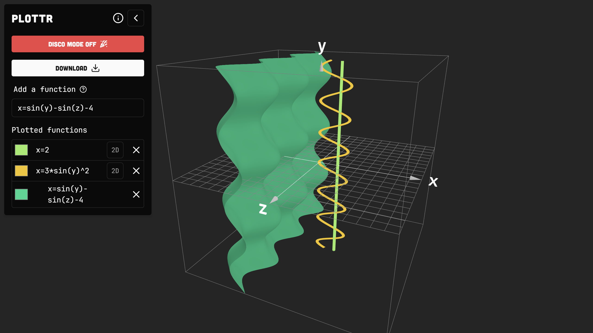

# Plottr

A function graph plotter using TresJs and Vue.



Also includes a disco mode, where the function "dance", confeti falls, a reflective disco ball appears and a fountain of star sparkles emerges.

## Features

- Plot functions
- Customize the color of the plot
- 🕺Disco Mode🕺

## Run Locally

Install dependencies and run the project.

```bash
  npm install
  npm run dev
```
